# Presidential Debates Explorer

Python-проект для анализа корпуса президентских дебатов США.  
Проект превращает CSV в структурированную объектную модель, позволяет гибко фильтровать дебаты и получать агрегированную статистику по выбранному подкорпусу.

---

1. **Парсинг корпуса**
   - CSV → Python-объекты (`Debate`, `Utterance`, `Politician`)
   - корректная обработка политиков, модераторов и повторяющихся названий дебатов
   - уникальность дебатов определяется по `link`

2. **Фильтрация дебатов**
   - по годам
   - по типу дебатов (primaries / general)
   - по политикам
   - режим `ANY` / `BOTH` для анализа «кто с кем»

3. **Пользовательский анализ**
   - базовая статистика по дебатам
   - частотные слова

---

## Project structure
├── debates_explorer.py   # пользовательский интерфейс для статистики

├── parser.py             # CSV -> объекты

├── filter.py             # фильтрация дебатов

├── model.py              # Politician / Debate / Utterance

├── politicians_data.py   # справочник политиков

├── helper_functions.py   # предобработка текстов и другие вспомогательные функции

├── enums.py              # Party / Gender / DebateType

└── debates.csv


## Example usage
### 1. Загрузка корпуса

```python
from parser import DebateParser

parser = DebateParser()
parser.load_csv("debates.csv")

print(len(parser.debates))
print(len(parser.politicians))
```
174

97

### 2. Фильтрация
```python
from filter import DebateFilter
from enums import DebateType

bf = DebateFilter(parser)

# все дебаты
all_debates = bf.filter_debates()

# все дебаты 2020 года
debates_2020 = bf.filter_debates(years=[2020])

# только general debates
general_debates = bf.filter_debates(debate_type=DebateType.GENERAL)
```


### 3. Фильтрация по политикам (ANY)
```python
# все дебаты, где участвует либо BIDEN, либо TRUMP
any_biden_trump = bf.filter_debates(
    politicians=["BIDEN", "TRUMP"],
    both=False
)
```


### 4. Фильтрация по политикам (BOTH)
```python
# только дебаты, где участвуют и BIDEN, и TRUMP
both_biden_trump = bf.filter_debates(
    politicians=["BIDEN", "TRUMP"],
    both=True
)
```

### 5. Комбинированные фильтры
```python
# General debates 2020 года с участием BIDEN и TRUMP
subset = bf.filter_debates(
    years=[2020],
    debate_type=DebateType.GENERAL,
    politicians=["BIDEN", "TRUMP"],
    both=True
)
```

## DebateExplorer
DebateExplorer предоставляет инструменты для получения сводной статистики по выбранному набору дебатов.
Он работает на уже отфильтрованных объектов Debate и предназначен для корпусного и сравнительного анализа дискурса президентских дебатов.

### 6. Только базовая статистика
```python
from debates_explorer import DebateExplorer

explorer = DebateExplorer(subset)
explorer.show_debates_stats()
```
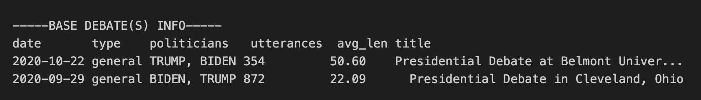

### 7. Базовая статистика + частотные слова
```python
explorer = DebateExplorer(
    debates=subset,
    include=["most_common_words"],
    top_n_words=15
)
explorer.show_debates_stats()
```
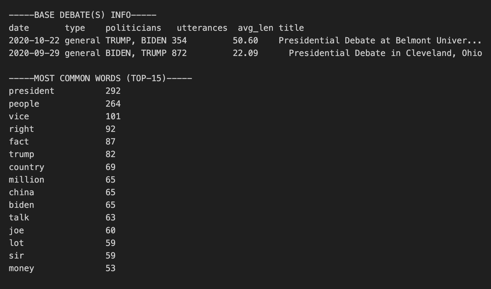

### 8. Анализ эмоциональной тональности
```python
explorer = DebateExplorer(
    debates=both_biden_trump,
    include=["emotions"]
)
explorer.show_debates_stats()
```
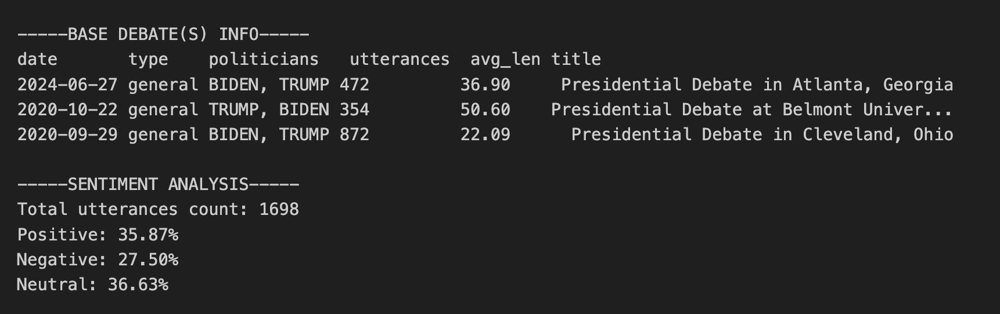

## PoliticianExplorer 
PoliticianExplorer предназначен для анализа отдельных политиков и их сравнений на основе корпуса президентских дебатов, уже загруженного и распарсенного с помощью DebateParser.

PoliticianExplorer поддерживает три ключевых исследовательских сценария:
1.	Профиль одного политика по всему корпусу
2.	Сравнение двух политиков
3.	Сравнение поведения одного политика в двух группах дебатов (с разными оппонентами)


### 1. Профиль одного политика
Метод: show_politician_info

Позволяет получить полную сводку по одному политику:
- базовая информация (имя, партия, пол, дата рождения)
- список всех дебатов, в которых он участвовал
- список оппонентов и частота совместных дебатов
- наиболее частотные слова в репликах политика
- сентимент-анализ (доли positive / negative / neutral)

```python
from politician_explorer import PoliticianExplorer

pexp = PoliticianExplorer(parser)

pexp.show_politician_info(
    "TRUMP",
    top_n_words=15
)
```
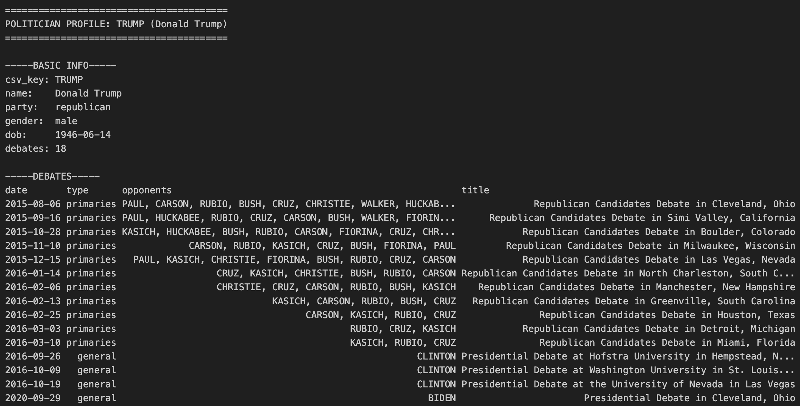
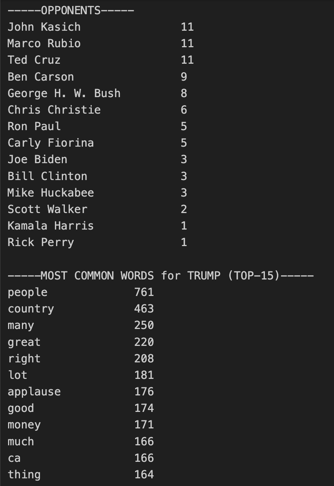
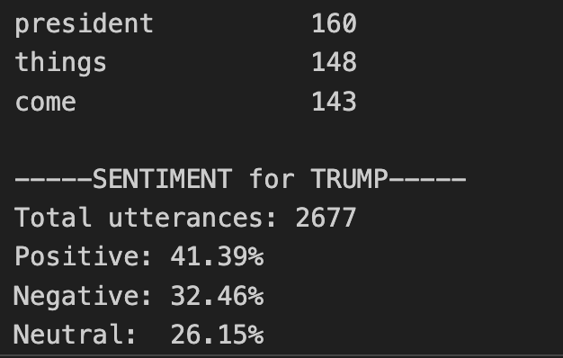


### 2. Сравнение двух политиков
Метод: compare_two_politicians

Позволяет сравнить двух политиков по всему корпусу дебатов, включая:
- количество дебатов
- количество реплик
- среднюю длину реплики
- сентимент-профиль
- наиболее частотные слова для каждого политика

```python
pexp.compare_two_politicians(
    "BIDEN",
    "TRUMP",
    top_n_words=15
)
```
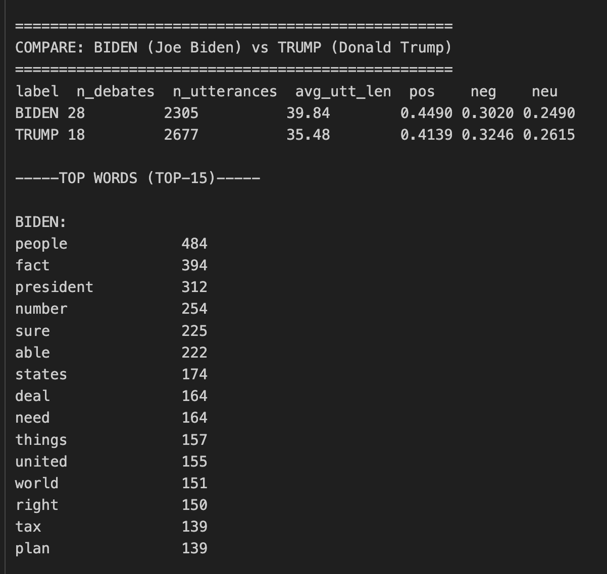
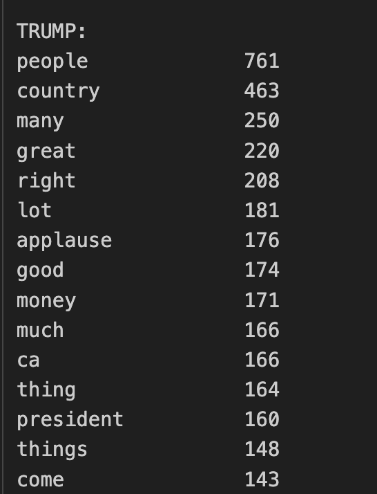


### 3. Один политик в двух группах дебатов

Метод: compare_politician_in_two_groups

Позволяет сравнить поведение одного и того же политика в двух разных контекстах — например:
- дебаты с конкретным оппонентом vs без него
- праймериз vs общие выборы
- ранние кампании vs поздние

Метод принимает две заранее отфильтрованные группы дебатов.

```python
group_with_trump = bf.filter_debates(
    politicians=["BIDEN", "TRUMP"],
    both=True
)

group_without_trump = [
    d for d in parser.debates
    if any(p.csv_key == "BIDEN" for p in d.politicians)
    and not any(p.csv_key == "TRUMP" for p in d.politicians)
]

pexp.compare_politician_in_two_groups(
    politician_surname="BIDEN",
    group_a=group_with_trump,
    group_b=group_without_trump,
    group_a_name="With Trump",
    group_b_name="Without Trump",
    top_n_words=15
)
```
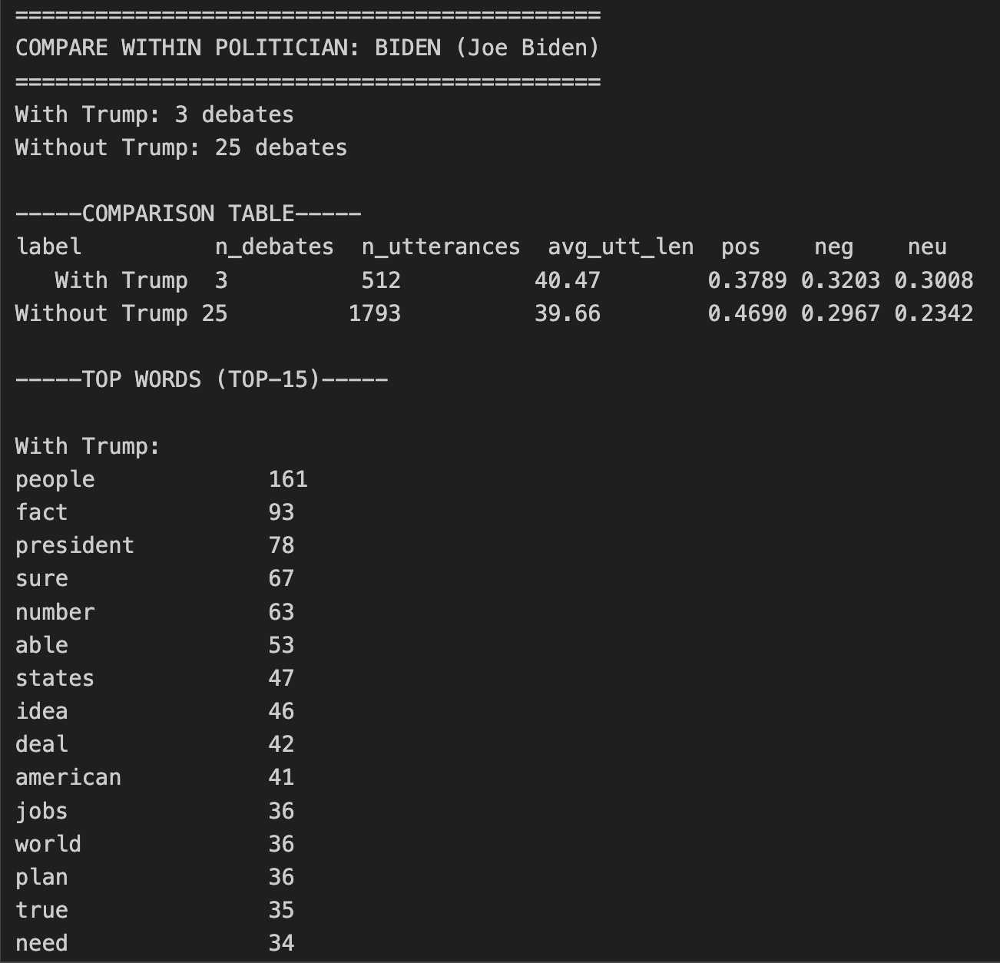
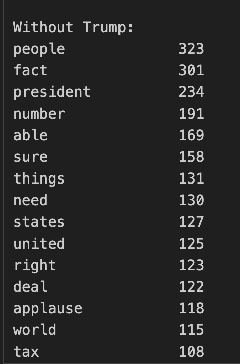


### 4. Один политик с разными оппонентами
```python
group_trump_biden = bf.filter_debates(
    politicians=["TRUMP", "BIDEN"],
    both=True
)

group_trump_clinton = bf.filter_debates(
    politicians=["TRUMP", "CLINTON"],
    both=True
)

pexp.compare_politician_in_two_groups(
    politician_surname="TRUMP",
    group_a=group_trump_biden,
    group_b=group_trump_clinton,
    group_a_name="Trump WITH Biden",
    group_b_name="Trump WITH Clinton",
    top_n_words=15
)
```
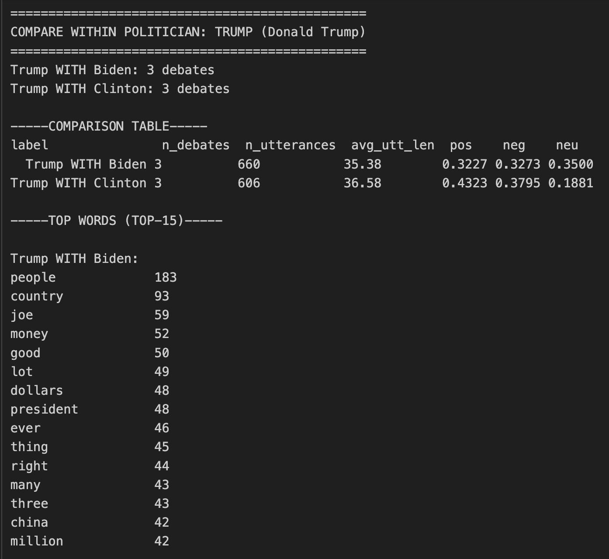
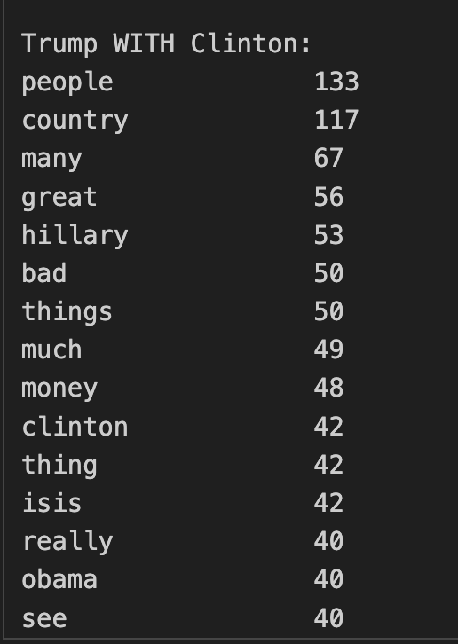